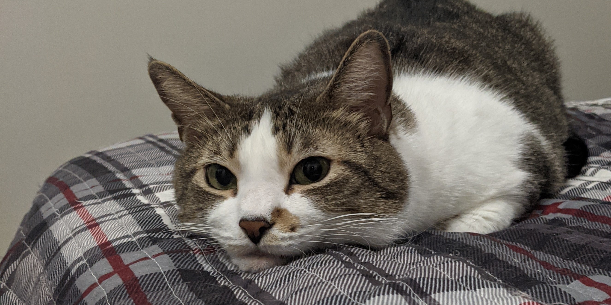

I'm a Software Engineer and Aspiring Open Source Contributor, interested in developer tooling and software optimization. I have 3+ years of experience with modern C++, with plenty of experience implementing build systems and developer tooling.

I worked as a Software Engineer over at [Bolt Graphics](https://bolt.graphics/), where I took part in developing Bolt Graphics' novel, hardware-accelerated raytracing platform.

I'm a [SUNY University at Buffalo](https://buffalo.edu/) graduate, with a [combined BS/MS Computer Science degree](https://engineering.buffalo.edu/computer-science-engineering/undergraduate/degrees-and-programs/bs-ms-in-computer-science-and-engineering.html) specializing in High-Performance Computing and Distributed Systems.

[See my resume at this PDF link](/assets/files/nicolas-barrios-resume-v8.pdf).

