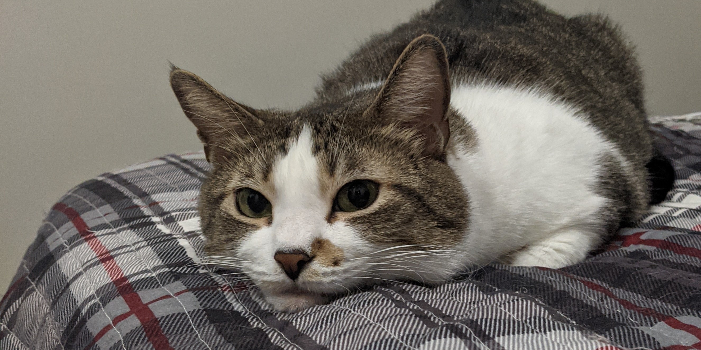

I'm a Software Engineer and Aspiring Open Source Contributor. With over 4 years of professional experience with modern C++ and Python implementing high performance software in the fields of high frequency trading and computer graphics, I'm interested in developing high-performance solutions and advancing emerging software platforms.

I have previously worked as a Software Engineer at [Simplex Trading](https://simplextrading.com/), a high-frequency trading firm, where I focused on the development and optimization of mission-critical trading infrastructure. My work involved navigating a massive, stable C++ codebase to build high-performance backend systems and sophisticated Qt-based frontends, ensuring the seamless flow of data across parallelized applications.

I have also worked as a Software Engineer over at [Bolt Graphics](https://bolt.graphics/), where I took part in developing Bolt Graphics' novel, hardware-accelerated raytracing platform.

I'm a [SUNY University at Buffalo](https://buffalo.edu/) graduate, with a [combined BS/MS Computer Science degree](https://engineering.buffalo.edu/computer-science-engineering/undergraduate/degrees-and-programs/bs-ms-in-computer-science-and-engineering.html) specializing in High-Performance Computing and Distributed Systems.

[See my resume at this PDF link](/assets/files/nicolas-barrios-resume-v8.pdf).

